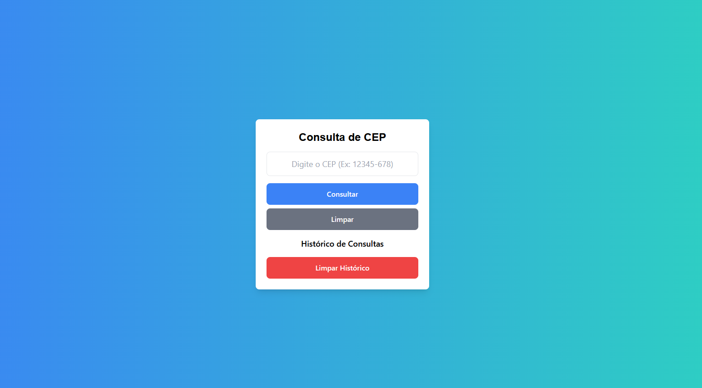

# 📌 Localizador de CEP  

O **Localizador de CEP** é uma aplicação web que permite consultar informações detalhadas de endereços a partir de um CEP informado. Ele faz requisições a uma API para obter dados como **logradouro, bairro, cidade e estado**, exibindo os resultados de forma organizada e intuitiva para o usuário.

  

## 🚀 Funcionalidades  
✅ Consulta rápida de CEPs  
✅ Exibição de endereço completo  
✅ Interface moderna e responsiva  
✅ Histórico de pesquisas armazenado no banco de dados  
✅ Backend otimizado com cache para melhor desempenho  

## 🛠 Tecnologias Utilizadas  
- **Frontend**: HTML, Tailwind CSS, JavaScript  
- **Backend**: Flask (Python)  
- **Banco de Dados**: SQLite  
- **API**: ViaCEP  

## 📦 Como Executar o Projeto  

### 🔧 Requisitos  
- Python 3 instalado  
- Pip instalado  

### ▶️ Rodando o Backend  
1. Clone o repositório:  
   ```bash
   git clone https://github.com/seu-usuario/localizador-cep.git
   cd localizador-cep
